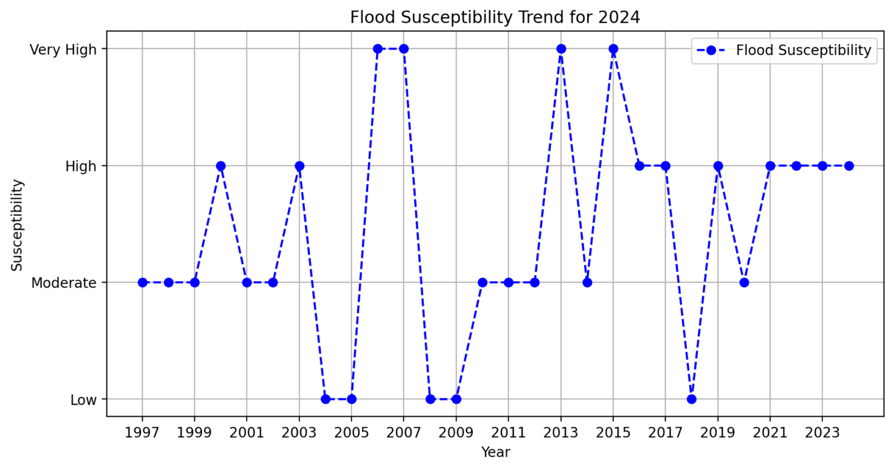
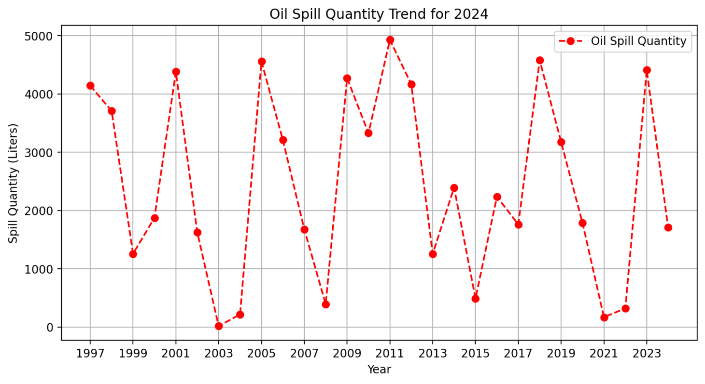

# Flood & Oil Spillage Prediction App 🌊🛢️

This app predicts flood susceptibility and oil spillage risks based on environmental and operational parameters. It leverages machine learning algorithms to provide users with insights into potential environmental risks, helping them take proactive steps in disaster preparedness. The app allows users to input specific parameters and a year to receive predictions for **Flood Susceptibility** and **Oil Spill Quantity & Danger**.

## Features ✨
- **Flood Prediction**: Predict the likelihood of flood susceptibility based on environmental parameters like slope, rainfall, and topographic wetness index (TWI).
- **Oil Spill Prediction**: Estimate the quantity of oil spills and assess the danger based on facility type, cause, and location.
- **Year-Specific Predictions**: Users can input the year to receive predictions relevant to that specific year.
- **User Authentication**: Secure login and sign-up functionality for personalized prediction results.
- **Graphical Representation**: Visualize the prediction data with graphs for better decision-making.

## Tech Stack 🛠️
- **Backend**: Python
- **Frontend**: Streamlit (for interactive web interface)
- **Machine Learning**: Scikit-learn (for predictive models)
- **Data Storage**: Local storage for session data
- **Visualization**: Matplotlib (for plotting graphs)
- **Deployment**: Streamlit sharing or any cloud-based platform

## Installation 📦

### 1. Clone the Repository

```bash
git clone https://github.com/yourusername/flood-oil-spill-prediction.git
cd flood-oil-spill-prediction
```

### 2. Set Up a Virtual Environment (Recommended)

```bash
python -m venv venv
source venv/bin/activate  # For Windows use `venv\Scripts\activate`
```

### 3. Install Dependencies

```bash
pip install -r requirements.txt
```

### 4. Run the App

```bash
streamlit run app.py
```

This will launch the app in your default web browser, where you can start interacting with the prediction models.

## Usage 📊

### 1. **Sign Up/Login**

- Users must create an account or log in to access the prediction functionalities.
- Once logged in, users can choose between **Flood Prediction** and **Oil Spillage Prediction**.

### 2. **Enter Input Parameters**

#### **Flood Prediction**:
- Input environmental parameters such as **slope**, **rainfall**, **topographic wetness index (TWI)**, and others.
- Select the year for which you want the prediction.
- Click on "Predict" to get the flood susceptibility level for the given year.

#### **Oil Spillage Prediction**:
- Input parameters like **facility type**, **spill cause**, **latitude**, **longitude**, and others.
- Select the year for which you want the prediction.
- Click on "Predict" to get the estimated oil spill quantity and its danger assessment.

### 3. **View Results**

After clicking "Predict", you will:
- Receive a flood susceptibility level (Low, Moderate, High, Very High) or an oil spill danger level.
- View a graphical representation of the trends for the selected year.

### 4. **Logout**

You can log out of your account via the sidebar.

## Graphical Visualizations 📈

The app provides interactive graphs that show:
- **Flood Susceptibility Trends** for the selected year.
- **Oil Spill Quantity Trends** for the selected year.

These graphs provide valuable insights into environmental risks over time, helping you visualize the potential outcomes based on your input parameters.

## Example Screenshots 📸


*Flood prediction result showing flood susceptibility for a selected year.*


*Oil spill prediction result with estimated quantity and danger assessment.*

## Contributing 🤝

We welcome contributions to this project! If you would like to contribute, follow these steps:

1. Fork the repository.
2. Create a new branch (`git checkout -b feature/your-feature-name`).
3. Make your changes and commit them (`git commit -am 'Add new feature'`).
4. Push to your branch (`git push origin feature/your-feature-name`).
5. Open a Pull Request.

### Issues and Bugs
If you encounter any issues or bugs, please open an issue in the **Issues** tab of the repository. Provide a detailed description of the issue, and if possible, include steps to reproduce.

## License 📄

This project is licensed under the MIT License - see the [LICENSE](LICENSE) file for details.

## Contact 📬

For any questions, suggestions, or collaborations, feel free to reach out to:

**Project Maintainer**:  
[Nnennaya](mailto:youremail@example.com)

